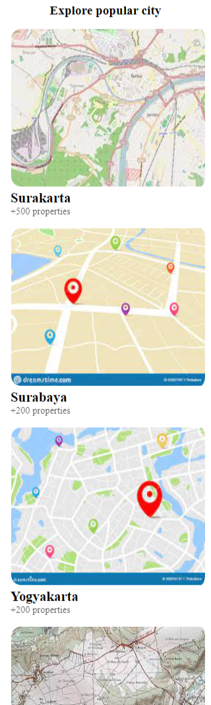

# HOMA
## ABOUT
The project is about promoting the selling of Houses, Apartments and Lands.
## EFFortless Property Discovery
    Rapidey get to the desired Land, Apartment, or House without much efforts by just selecting thedesired item and entering the location,Budget and Filter needed.
   
## Discover
     This section is conern with the exposition of houses and apartments, view the images and select the desired house
   
   ## Explore popular city
   This section is concern with the exposition of lands for sale and their various location on the map 
    

## Project Technical
## Built with:
    HTML and CSS
## How to install and run the project
    - Go to your playstore for androids and appstore for apple phones and type Homa,
    - get in the homa icon as design and showed up and press on it to start the download,
    - once the download complete press on the intall button on the left and intall your app,
    - once the app is install go back to your main-screen and press on it to run,
    - go to the sign in option and press on it to sign in,
    _ once the sign in is done , select the desired property and and filtter it according to your needs and expectations (location, Budget and other filters)
    -then press on the Button Discover down to access your desired property
## Live site
    [Homa-site](https://yemataferry.github.io/Homa-page/)
## Author
     **Yemata Ferry**
      - GitHub: [@yemataferry](https://github.com/yemataferry/Homa-page/pull/1)

